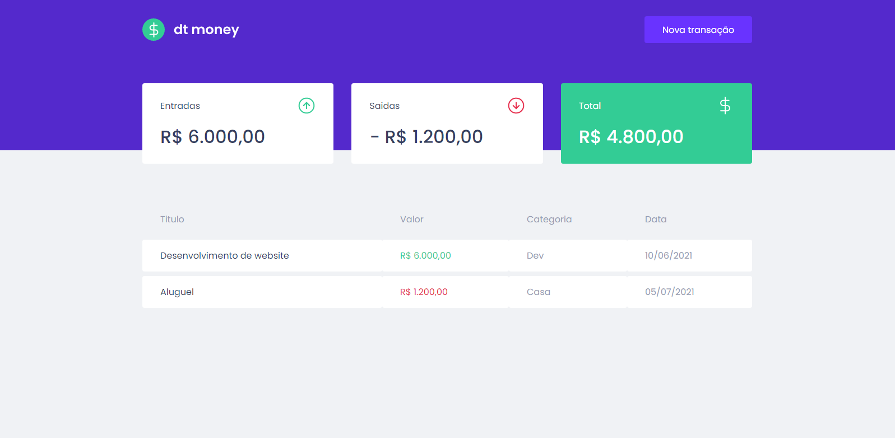
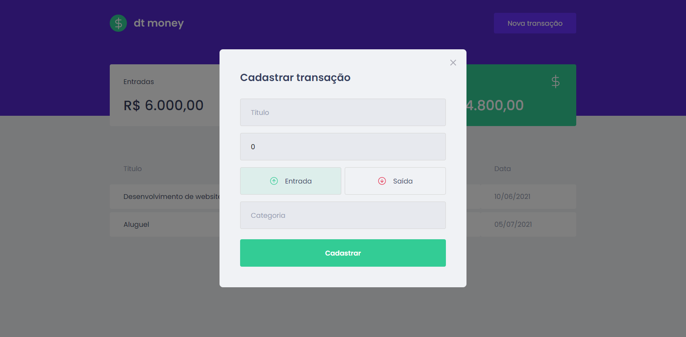

<h1 align="center"> Welcome to dtmoney 👋</h1>
<h1 align="center"> Bem-vindo ao dtmoney 👋</h1>
<p>
  
  <a href="https://github.com/lucasfgs/dtmoney/graphs/commit-activity" target="_blank">
    
  </a>
  <a href="https://github.com/lucasfgs/dtmoney/blob/master/LICENSE" target="_blank">
    
  </a>
</p>

> A project developed at rocketset ignite bootcamp 🚀  
> Projeto realizado durante o bootcamp ignite da Rocketseat 🚀





## Install

```sh
yarn install
```

## Usage

```sh
yarn start
```

## Author

👤 **Lucas Ferreira**

* Github: [@lucasfgs](https://github.com/lucasfgs)
* LinkedIn: [@Lucas Ferreira](https://br.linkedin.com/in/lucas-ferreira-44a90916b)

## Show your support

Give a ⭐️ if this project helped you!

## 📝 License

Copyright © 2021 [Lucas Ferreira](https://github.com/lucasfgs).<br />
This project is [MIT](https://github.com/lucasfgs/dtmoney/blob/master/LICENSE) licensed.

***
_This README was generated with ❤️ by [readme-md-generator](https://github.com/kefranabg/readme-md-generator)_